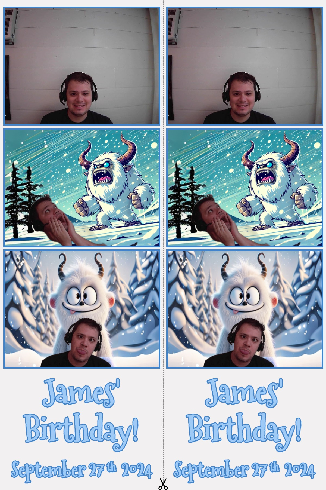

# Photobooth

Every 5 years or so it seems like I take another stab at a photobooth, here is 2024's incarnation

## Configure

You can configure the text by adding a `.env` with something like:

```.env
VITE_LINE_1="James'"
VITE_LINE_2="Birthday!"
VITE_LINE_3="September 27    2024"
VITE_LINE_3_SUPERSCRIPT="th"
VITE_LINE_3_SUPERSCRIPT_OFFSET=-10;
```

You can update the settings but updating things in `/app/constants/`

This is designed for an Amazon Fire HD 10, to adjust screen and webcame settings see: `app/constants/screen.ts`

For colors see: `app/constants/colors.ts`

Font and other final image settings: `app/constants/canvas.ts`

## Usage

`npm run prod` will build and serve a prod build on 5173.

It takes 3 images and then you can "Yeti-ize" any of them and remove the background and insert a yeti!

It uses IPP/AirPrint to send the image to the printer. It works on a Canon Selphy at least, didn't test any other printers.

The final image is a 4x6 which can be cut into 2 strips.



## Development

Run the dev server:

```shellscript
npm run dev
```

### DIY

- 📖 [Remix docs](https://remix.run/docs)

If you're familiar with deploying Node applications, the built-in Remix app server is production-ready.

Make sure to deploy the output of `npm run build`

- `build/server`
- `build/client`

## Styling

This template comes with [Tailwind CSS](https://tailwindcss.com/) already configured for a simple default starting experience. You can use whatever css framework you prefer. See the [Vite docs on css](https://vitejs.dev/guide/features.html#css) for more information.
